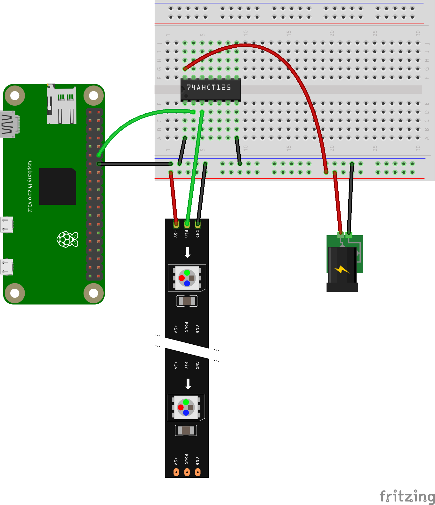

# Wordclock

French word clock for Raspberry Pi with WS2812B LEDs.

## Inspiration

This is a fork from the project [tidsram](https://github.com/machosallad/tidsram) of [machosallad](https://github.com/machosallad).
Many thanks to them for providing their code!

The code and build is inspired by the following makers:

- [rpi_wordclock](https://github.com/bk1285/rpi_wordclock) by [bk1285](https://github.com/bk1285)
- [LED Word Clock](https://www.youtube.com/watch?v=SXYwSN6mX_Q) ([code](https://github.com/ckuo23/wordclock)) by [Chloe Kuo](https://www.youtube.com/channel/UC0ybj4KuDQc_jOx1ONrlrfw)

## Features

- Display the current time with resolution of one minute.
- Pygame to run the main loop consistently.
- Abstract display allows development without access to WS2812B LEDs.
- Control various settings through MQTT.

## Font

D-DIN font by Datto licensed under the [SIL Open Font License (OFL)](https://scripts.sil.org/cms/scripts/page.php?site_id=nrsi&id=OFL).

## Configuration

A configuration file allows the user to make adjustments to the application. Such as: LED brightness & color, run simulated time etc.
Make a copy of `settings.conf.example`, save it as `settings.conf` and then change the available fields to suitable values.
The configuration is read when the application starts, so make sure to restart the application for the change to take effect.

## MQTT topics

Settings such as adjusting the brightness or changing the color of the LEDs are done using MQTT.
The topics are tied to specific plugins or core modules.

### Clock

- wordclock/plugin/clock/on
- wordclock/plugin/clock/off
- wordclock/plugin/clock/day
- wordclock/plugin/clock/minute
- wordclock/plugin/clock/rainbow

### Display

- wordclock/display/brightness

### Temperature

- wordclock/plugin/temperature/on
- wordclock/plugin/temperature/off
- wordclock/plugin/temperature/rainbow
- wordclock/plugin/temperature/location

## Assembly instructions

1. Wire the Raspberry Pi according to this diagram (a diode can also be used, see [here](https://learn.adafruit.com/neopixels-on-raspberry-pi/raspberry-pi-wiring))

1. Install Raspberry Pi OS
1. Clone this github and change directory with `git clone https://github.com/coxla1/wordclock.git; cd wordclock`
1. Install CircuitPython and NeoPixel library following [this](https://learn.adafruit.com/circuitpython-on-raspberrypi-linux/installing-circuitpython-on-raspberry-pi) and [this](https://learn.adafruit.com/neopixels-on-raspberry-pi/python-usage)
1. Install requirements with `pip3 install -r requirements.txt`
1. Install a MQTT server on the Raspberry (mosquitto for instance)
1. Setup your `settings.conf`
1. You can run the script with `python3 app.py`, or add it as a service (see [here](https://gist.github.com/emxsys/a507f3cad928e66f6410e7ac28e2990f))